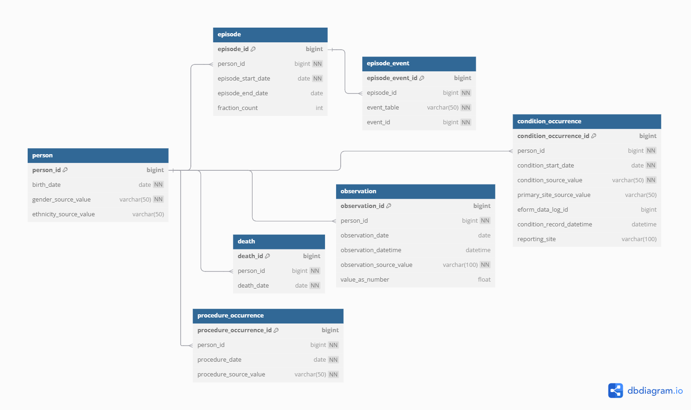

This repo was forked from https://github.com/christie-nhs-data-science/DQMaRC and will form the basis of the data profiling tool for the STARTER-KIT project.

# Prototype Data Model

(See also prototype_data_model.dbml)

The prototype data model includes the OMOP v5.4 person / visit / condition / drug_exposure / measurement tables, plus the episode and episode_event tables from the OMOP oncology extension.
 
Each 'event' e.g. visit, condition, drug exposure, measurement is tied to an 'episode' with a start and end date e.g. 1st line chemo, 2nd line chemo, radiation therapy, surgical treatment, disease relapse, palliative care etc via the episode_event table.

## Notes

* Blue box = a table/spreadsheet

    * person: one row per patient

    * visit: one row per clinic/hospital encounter

    * condition: one row per diagnosis

    * drug_exposure: one row per drug administration

    * measurement: one row per lab result/biometric

    * episode: one row per course/phase of treatment

    * episode_event: link table tying each individual event to an episode

    * Key icon next to a column = primary key (uniquely identifies each row)

* Lines = foreign-key relationships

    * ○—< zero-or-many (e.g. one person may have many visits)

    * |—< one-to-many (e.g. each episode may have many events, and every event must point to one episode)